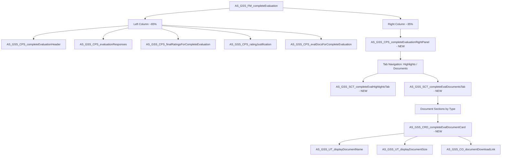
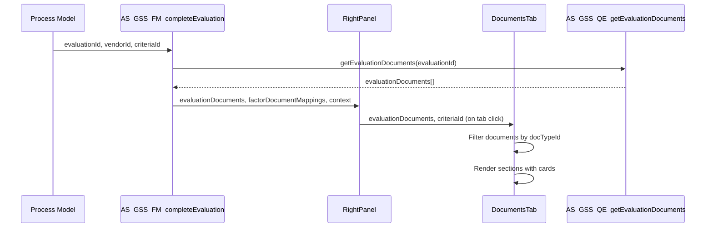

# Design Document: Complete Evaluation Document Section Revamp

## Overview

This design adds a right-hand panel with "Highlights" and "Documents" tabs to the Complete Evaluation form (`AS_GSS_FM_completeEvaluation`). The form layout changes from a single-column to a two-column layout. The Documents tab displays evaluation documents organized by type sections using a redesigned document card. The implementation follows the established right-panel pattern from the Consensus Form (`AS_GSS_SCT_submitConsensusRightPanelAdditionalInfo`) and reuses existing document display utilities.

## Architecture

The Complete Evaluation form is restructured into a two-column layout:



### Key Design Decisions

1. **Two tabs only (Highlights + Documents)**: Per the acceptance criteria, only "Highlights" and "Documents" tabs are implemented. The existing design document referenced 4 tabs, but the AC scopes this to 2.
2. **Reuse `AS_GSS_SCT_displayDocumentsInSections` pattern**: The Documents tab follows the same sectioned document display pattern used in the Consensus Form, but with a new card design.
3. **New document card component**: A new `AS_GSS_CRD_completeEvalDocumentCard` is created to match the new design mockup, rather than modifying the existing `AS_GSS_CRD_displayEvaluationDocument` which is used elsewhere.
4. **Document upload stays in left column**: The existing `AS_GSS_CPS_evalDocsForCompleteEvaluation` (upload functionality) remains in the left column. The right panel Documents tab is read-only display.
5. **Tab state via `a!localVariables`**: Follows the consensus form pattern for tab state management.

## Components and Interfaces

### New Components

#### 1. AS_GSS_CPS_completeEvaluationRightPanel (Interface)

Container for the right panel with 2-tab navigation.

**Inputs:**

| Parameter | Type | Description |
|-----------|------|-------------|
| `evaluationId` | Integer | The evaluation record ID |
| `vendorId` | Integer | The vendor being evaluated |
| `criteriaId` | Integer | Current criteria/factor ID |
| `evaluationDocuments` | CDT Array | Pre-fetched evaluation documents |
| `factorDocumentMappings` | CDT Array | Factor-document mappings |
| `i18nData` | Map | Internationalization bundle |

**SAIL Pseudocode:**
```
a!localVariables(
  local!selectedTab: 1,  /* 1 = Highlights, 2 = Documents */
  
  a!sectionLayout(
    contents: {
      /* Tab Navigation Bar */
      a!columnsLayout(
        columns: {
          a!columnLayout(
            contents: a!richTextDisplayField(
              value: a!richTextItem(
                text: rule!AS_CO_I18N_UT_displayLabel(i18nData: ri!i18nData, bundleKey: "lbl_Highlights"),
                link: a!dynamicLink(value: 1, saveInto: local!selectedTab),
                style: if(local!selectedTab = 1, "STRONG", "PLAIN"),
                color: if(local!selectedTab = 1, "ACCENT", "SECONDARY")
              )
            ),
            width: "AUTO"
          ),
          a!columnLayout(
            contents: a!richTextDisplayField(
              value: a!richTextItem(
                text: rule!AS_CO_I18N_UT_displayLabel(i18nData: ri!i18nData, bundleKey: "lbl_Documents"),
                link: a!dynamicLink(value: 2, saveInto: local!selectedTab),
                style: if(local!selectedTab = 2, "STRONG", "PLAIN"),
                color: if(local!selectedTab = 2, "ACCENT", "SECONDARY")
              )
            ),
            width: "AUTO"
          )
        },
        spacing: "DENSE"
      ),
      
      /* Tab underline indicator */
      a!richTextDisplayField(value: a!richTextItem(text: "─", color: "SECONDARY")),
      
      /* Tab Content - conditionally rendered via if() */
      if(
        local!selectedTab = 1,
        /* Highlights Tab Content */
        rule!AS_GSS_SCT_completeEvalHighlightsTab(
          evaluationId: ri!evaluationId,
          vendorId: ri!vendorId,
          criteriaId: ri!criteriaId,
          i18nData: ri!i18nData
        ),
        /* Documents Tab Content (selectedTab = 2) */
        rule!AS_GSS_SCT_completeEvalDocumentsTab(
          evaluationDocuments: ri!evaluationDocuments,
          factorDocumentMappings: ri!factorDocumentMappings,
          criteriaId: ri!criteriaId,
          i18nData: ri!i18nData
        )
      )
    }
  )
)
```

#### 2. AS_GSS_SCT_completeEvalHighlightsTab (Interface)

Displays evaluation highlights for the current factor/vendor context.

**Inputs:**

| Parameter | Type | Description |
|-----------|------|-------------|
| `evaluationId` | Integer | The evaluation record ID |
| `vendorId` | Integer | The vendor being evaluated |
| `criteriaId` | Integer | Current criteria/factor ID |
| `i18nData` | Map | Internationalization bundle |

**Behavior:**
- Displays contextual highlights relevant to the current evaluation
- Shows empty state message when no highlights are available
- Placeholder for future content (the AC focuses on the Documents tab design)

#### 3. AS_GSS_SCT_completeEvalDocumentsTab (Interface)

Displays evaluation documents organized by type sections.

**Inputs:**

| Parameter | Type | Description |
|-----------|------|-------------|
| `evaluationDocuments` | CDT Array | All evaluation documents |
| `factorDocumentMappings` | CDT Array | Factor-document mappings |
| `criteriaId` | Integer | Current criteria/factor ID for filtering |
| `i18nData` | Map | Internationalization bundle |

**SAIL Pseudocode:**
```
a!localVariables(
  /* Group documents by type */
  local!factorDocs: filter by docTypeId = cons!AS_GSS_REF_ID_DOC_TYPE_FACTOR,
  local!referenceDocs: filter by docTypeId = cons!AS_GSS_REF_ID_DOC_TYPE_REFERENCE,
  local!vendorDocs: filter by docTypeId = cons!AS_GSS_REF_ID_DOC_TYPE_VENDOR,
  local!evaluatorDocs: filter by docTypeId = cons!AS_GSS_REF_ID_DOC_TYPE_EVALUATOR,
  
  local!hasAnyDocs: length(ri!evaluationDocuments) > 0,
  
  if(
    not(local!hasAnyDocs),
    rule!AS_GSS_CPS_emptyStateForDocuments(bundle: ri!i18nData),
    {
      /* Factor Documents Section - only render if docs exist */
      if(
        length(local!factorDocs) > 0,
        {
          a!richTextDisplayField(
            value: a!richTextItem(
              text: rule!AS_CO_I18N_UT_displayLabel(i18nData: ri!i18nData, bundleKey: "lbl_FactorDocuments"),
              style: "STRONG",
              size: "SMALL"
            )
          ),
          a!forEach(items: local!factorDocs, expression:
            rule!AS_GSS_CRD_completeEvalDocumentCard(
              evaluationDocument: fv!item,
              i18nData: ri!i18nData
            )
          )
        },
        {}
      ),
      /* Reference Documents Section - same conditional pattern */
      if(
        length(local!referenceDocs) > 0,
        {
          a!richTextDisplayField(
            value: a!richTextItem(
              text: rule!AS_CO_I18N_UT_displayLabel(i18nData: ri!i18nData, bundleKey: "lbl_ReferenceDocuments"),
              style: "STRONG",
              size: "SMALL"
            )
          ),
          a!forEach(items: local!referenceDocs, expression:
            rule!AS_GSS_CRD_completeEvalDocumentCard(
              evaluationDocument: fv!item,
              i18nData: ri!i18nData
            )
          )
        },
        {}
      ),
      /* Vendor Documents Section */
      if(
        length(local!vendorDocs) > 0,
        {
          a!richTextDisplayField(
            value: a!richTextItem(
              text: rule!AS_CO_I18N_UT_displayLabel(i18nData: ri!i18nData, bundleKey: "lbl_VendorDocuments"),
              style: "STRONG",
              size: "SMALL"
            )
          ),
          a!forEach(items: local!vendorDocs, expression:
            rule!AS_GSS_CRD_completeEvalDocumentCard(
              evaluationDocument: fv!item,
              i18nData: ri!i18nData
            )
          )
        },
        {}
      ),
      /* Evaluator Documents Section */
      if(
        length(local!evaluatorDocs) > 0,
        {
          a!richTextDisplayField(
            value: a!richTextItem(
              text: rule!AS_CO_I18N_UT_displayLabel(i18nData: ri!i18nData, bundleKey: "lbl_EvaluatorDocuments"),
              style: "STRONG",
              size: "SMALL"
            )
          ),
          a!forEach(items: local!evaluatorDocs, expression:
            rule!AS_GSS_CRD_completeEvalDocumentCard(
              evaluationDocument: fv!item,
              i18nData: ri!i18nData
            )
          )
        },
        {}
      )
    }
  )
)
```

#### 4. AS_GSS_CRD_completeEvalDocumentCard (Interface)

New document card component following the updated design mockup.

**Inputs:**

| Parameter | Type | Description |
|-----------|------|-------------|
| `evaluationDocument` | CDT | Single evaluation document record |
| `i18nData` | Map | Internationalization bundle |
| `marginAbove` | Text | Optional margin above (default: "STANDARD") |

**Visual Design:**
```
┌──────────────────────────────────────────────────┐
│  📄  Document_Name_Here.pdf                      │
│      Download • 2.4 MB                     ⬇    │
└──────────────────────────────────────────────────┘
```

**SAIL Pseudocode:**
```
a!cardLayout(
  contents: {
    a!columnsLayout(
      columns: {
        /* File icon column */
        a!columnLayout(
          width: "EXTRA_NARROW",
          contents: a!richTextDisplayField(
            value: a!richTextIcon(
              icon: "file-text-o",
              color: rule!AS_GSS_BrandingValueByKey(brandingKey: "GrayThree", useSuiteBranding: true),
              size: "MEDIUM_PLUS"
            ),
            align: "CENTER"
          )
        ),
        /* Document info column */
        a!columnLayout(
          contents: {
            /* Document name - truncated with ellipsis */
            a!richTextDisplayField(
              value: a!richTextItem(
                text: rule!AS_GSS_UT_displayDocumentName(
                  bundle: ri!i18nData,
                  version: ri!evaluationDocument.version,
                  extension: ri!evaluationDocument.fileType,
                  document: ri!evaluationDocument.appianDocId,
                  documentName: ri!evaluationDocument.documentName,
                  sourceApplicationId: ri!evaluationDocument.sourceApplication.refDataId
                )
              ),
              preventWrapping: true,
              tooltip: ri!evaluationDocument.documentName,
              marginBelow: "NONE"
            ),
            /* Download link + file size */
            a!richTextDisplayField(
              value: {
                a!richTextIcon(icon: "cloud-download", color: "ACCENT", size: "SMALL"),
                " ",
                a!richTextItem(
                  text: concat(
                    rule!AS_CO_I18N_UT_displayLabel(i18nData: ri!i18nData, bundleKey: "lbl_Download"),
                    " • ",
                    rule!AS_GSS_UT_displayDocumentSize(document: ri!evaluationDocument.appianDocId)
                  ),
                  color: "ACCENT",
                  size: "SMALL"
                )
              },
              preventWrapping: true
            )
          }
        ),
        /* Download action column */
        a!columnLayout(
          width: "EXTRA_NARROW",
          contents: a!richTextDisplayField(
            value: a!richTextIcon(
              icon: "download",
              link: rule!AS_GSS_CO_documentDownloadLink(
                document: ri!evaluationDocument.appianDocId,
                sourceApplicationId: ri!evaluationDocument.sourceApplication.refDataId
              ),
              linkStyle: "STANDALONE",
              altText: "Download document"
            ),
            align: "RIGHT"
          )
        )
      },
      alignVertical: "MIDDLE",
      spacing: "NONE"
    )
  },
  shape: "SEMI_ROUNDED",
  padding: "STANDARD",
  marginAbove: ri!marginAbove,
  showBorder: true,
  showShadow: false,
  style: "NONE"
)
```

### Modified Components

#### AS_GSS_FM_completeEvaluation (Interface - Modified)

**Changes:**
1. Wrap existing content in a `a!columnsLayout` with two columns
2. Left column (~65% width, `"WIDE"`) contains all existing child interfaces
3. Right column (~35% width, `"NARROW"`) contains the new right panel
4. Pass evaluation context data to the right panel

**Modified SAIL Structure:**
```
a!localVariables(
  /* ... existing local variables ... */
  
  a!columnsLayout(
    columns: {
      /* Left Column - Existing Content */
      a!columnLayout(
        width: "WIDE",
        contents: {
          rule!AS_GSS_CPS_completeEvaluationHeader(...),
          rule!AS_GSS_CPS_evaluationResponses(...),
          rule!AS_GSS_CPS_finalRatingsForCompleteEvaluation(...),
          rule!AS_GSS_CPS_ratingJustification(...),
          rule!AS_GSS_CPS_evalDocsForCompleteEvaluation(...)
        }
      ),
      /* Right Column - New Right Panel */
      a!columnLayout(
        width: "NARROW",
        contents: rule!AS_GSS_CPS_completeEvaluationRightPanel(
          evaluationId: local!evaluationId,
          vendorId: local!vendorId,
          criteriaId: local!criteriaId,
          evaluationDocuments: local!evaluationDocuments,
          factorDocumentMappings: local!factorDocumentMappings,
          i18nData: local!i18nData
        )
      )
    }
  )
)
```

## Data Models

### Existing Data Structures Used

**Evaluation Document Record (`AS_GSS_EvaluationDocument_SYNCEDRECORD`):**

| Field | Type | Description |
|-------|------|-------------|
| `id` | Integer | Primary key |
| `evaluationId` | Integer | FK to evaluation |
| `documentName` | Text | Display name of the document |
| `fileType` | Text | File extension (pdf, docx, etc.) |
| `appianDocId` | Integer | Appian document ID for download |
| `version` | Integer | Document version number |
| `docTypeId` | Integer | FK to document type reference data |
| `sourceApplication` | CDT | Source application info (contains `refDataId`) |
| `vendorId` | Integer | FK to vendor |
| `criteriaId` | Integer | FK to criteria/factor |

**Document Type Constants:**

| Constant | Value | Label |
|----------|-------|-------|
| `AS_GSS_REF_ID_DOC_TYPE_VENDOR` | 24 | Vendor Documents |
| `AS_GSS_REF_ID_DOC_TYPE_FACTOR` | 25 | Factor Documents |
| `AS_GSS_REF_ID_DOC_TYPE_EVALUATOR` | 26 | Evaluator Documents |
| `AS_GSS_REF_ID_DOC_TYPE_CONSENSUS` | 27 | Consensus Documents |
| `AS_GSS_REF_ID_DOC_TYPE_RECOMMENDATION` | 28 | Recommendation Documents |
| `AS_GSS_REF_ID_DOC_TYPE_REFERENCE` | 58 | Reference Documents |

### Data Flow



### Translation Keys

| Key | English Value |
|-----|---------------|
| `lbl_Highlights` | Highlights |
| `lbl_Documents` | Documents |
| `lbl_FactorDocuments` | Factor Documents |
| `lbl_ReferenceDocuments` | Reference Documents |
| `lbl_VendorDocuments` | Vendor Documents |
| `lbl_EvaluatorDocuments` | Evaluator Documents |
| `lbl_NoHighlightsAvailable` | No highlights available |


## Correctness Properties

*A property is a characteristic or behavior that should hold true across all valid executions of a system — essentially, a formal statement about what the system should do. Properties serve as the bridge between human-readable specifications and machine-verifiable correctness guarantees.*

Since this is an Appian SAIL (declarative UI) project, traditional property-based testing with randomized inputs is not directly applicable to the interface layer. However, the document filtering and grouping logic can be validated with properties. The following properties target the expression rules and data transformation logic that can be unit tested in Appian.

**Property 1: Document retrieval completeness**
*For any* evaluation with N associated documents, querying documents by evaluation ID should return exactly N documents, and every returned document should belong to that evaluation.
**Validates: Requirements 2.1**

**Property 2: Document section grouping correctness**
*For any* set of evaluation documents with mixed document types, grouping by `docTypeId` should produce sections where: (a) every document in a section has the matching `docTypeId`, (b) no document appears in more than one section, (c) the total count across all sections equals the input count, and (d) sections with zero documents are not rendered.
**Validates: Requirements 2.2, 2.4**

**Property 3: Document card displays all required fields**
*For any* evaluation document record with non-null `documentName`, `appianDocId`, and `docTypeId`, the document card rendering should include the document name (via `AS_GSS_UT_displayDocumentName`), the document size (via `AS_GSS_UT_displayDocumentSize`), and a download link (via `AS_GSS_CO_documentDownloadLink`).
**Validates: Requirements 3.1**

## Error Handling

| Scenario | Handling |
|----------|----------|
| Document query returns null/empty | Display empty state via `AS_GSS_CPS_emptyStateForDocuments` |
| Individual document has null `appianDocId` | Skip download link rendering, show document name only |
| Individual document has null `documentName` | Fall back to "Untitled Document" via `AS_GSS_UT_displayDocumentName` |
| Right panel data loading fails | Show error message in right panel; left column remains unaffected due to independent data flow |
| i18n bundle key missing | `AS_CO_I18N_UT_displayLabel` returns the key itself as fallback (existing pattern) |
| No highlights available | Display empty state message in Highlights tab |

## Testing Strategy

### Appian Testing Approach

Since this is an Appian SAIL project, testing follows Appian's testing patterns:

**Expression Rule Unit Tests (Appian Test Cases):**
- Test document filtering by `docTypeId` using `AS_CO_UT_filterCdtByField`
- Test empty document handling (zero documents → empty state)
- Test document grouping produces correct sections
- Test edge cases: single document type, all types present, no documents

**Interface Review Testing (Manual):**
- Verify tab navigation switches between Highlights and Documents
- Verify default tab is Highlights on form load
- Verify document cards display name, size, and download link
- Verify document name truncation with ellipsis on long names
- Verify empty state displays when no documents exist
- Verify left column functionality is preserved after layout change

**Property-Based Testing:**
- Property tests are not natively supported in Appian's test framework
- Properties 1-3 should be validated through comprehensive Appian expression rule test cases covering multiple input variations
- Each test case should reference the property it validates with a comment: `/* Feature: complete-evaluation-document-revamp, Property N: ... */`
- Minimum 5 test case variations per property to approximate property coverage

**Regression Testing:**
- Verify all existing Complete Evaluation form functionality works after the two-column layout change
- Verify document upload in left column still functions correctly
- Verify process model `AS GSS Complete Evaluation` passes all required parameters
